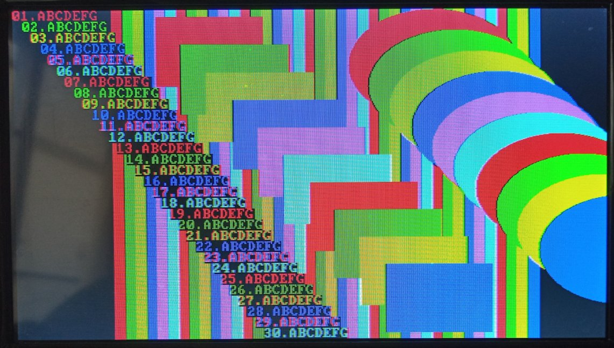
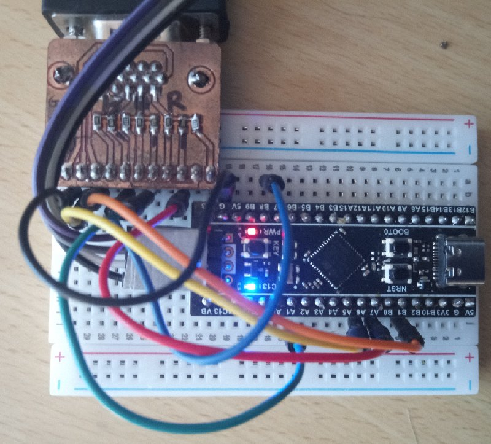

STM32F411でVGA(640x480)
 
 STM23F411で640x480で多色は無い様なので作ってみました(車輪の再発明かも)。
 途中経過なので、今後大幅変更も有り得ます。
 開発環境　：STM32CubeIDE 1.19.0+ST-LINK2
 ターゲット：BlackPill(STM32F411)
 こんな感じで表示されます。
 639ドット目に書き込むと表示が崩れるのは仕様です(禁止して無い)。
 (あれ、最下行が表示されてない様な)

 ハードはBlackPillをVGAコネクタに、hsVsは直付け、RGBは500オームが入ってます。
   HS  <- PA6
   VS  <- PB1
   R   <- PA7
   G   <- PA1
   B   <- PB8
   GND <- GND

